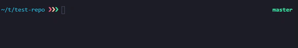
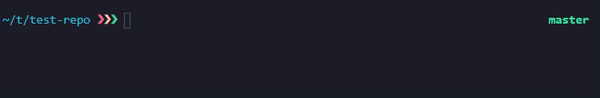
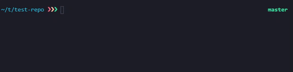
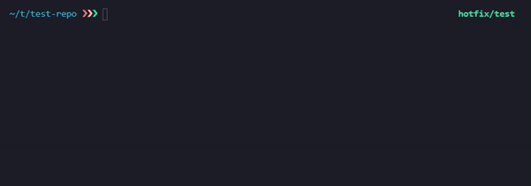
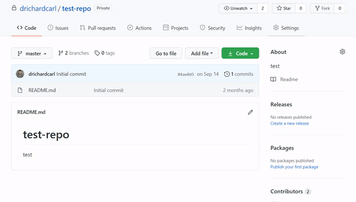
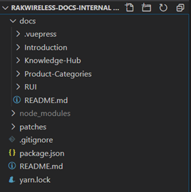
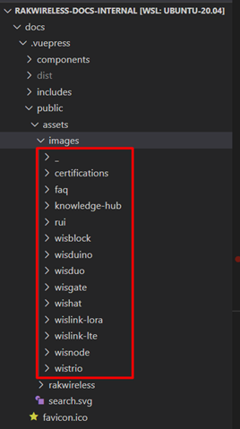
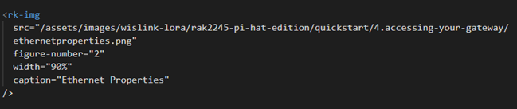
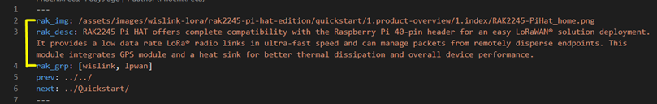
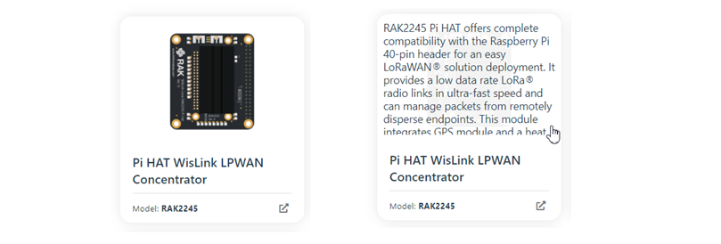

### Contributing to RAKwireless doc site

Contributing to **RAKwireless** documentation site requires basic knowledge in github and general git workflow. Also, there is a need to setup a working development environment.

#### 1. Setup local clone of private repository

Prerequisites:

- Install code editor (preferably [VS Code](https://code.visualstudio.com/download) )
- Install [Node JS](https://nodejs.org/en/)
- Install [Yarn package manager](https://yarnpkg.com/lang/en/docs/install/)

<ol type="i">
<li>Open terminal / command prompt</li>
<li>Change directory to your desired location (where you want to put rakwireless-docs repository)</li>
<li>Clone the repository: <code>git clone git@github.com:RAKWireless/rakwireless-docs.git</code></li>
<li>Change directory: <code>cd rakwireless-docs</code></li>
<li>Initialize modules: <code>yarn install</code></li>
<li>Run the local dev server: <code>yarn docs:dev</code></li>
</ol>

#### 2. Making content changes and pull requests

<ol type="i">
<li>Change directory to where <code>rakwireless-docs</code> folder is located</li>
<li>
From the root of the folder, make sure that the current branch is master: <code>git branch</code>

</li>
<li>
Make sure master branch is updated: <code>git pull origin master</code>

</li>
<li>
Branch out from master to commit some changes: <code>git checkout -b &lt;branch_name&gt;</code>

</li>
<li>
Make some changes and commit

</li>
<li>
Push your changes to remote repository: <code>git push origin &lt;branch_name&gt;</code>

</li>
<li>
In Github, create a pull request and wait for your PR to be accepted and merged to master

> **Note** :pencil:
> Create a detailed description of your pull request. Your PR's description must match exactly what the PR contains. Consider your PR automatically rejected if it's description is not that detailed and informative.

</li>
</ol>

#### 3. Important things to remember when editing \*.md files

<ol type="i">
<li>
Basic file structure of the repository

Most of the contents, lie on `docs`, like `Introduction`, `Knowledge-Hub`, `Product-Categories` and `RUI`. As you notice, naming of folders and markdown files follow this convention, so make sure to follow this as well.

</li>
<li>

All of images, pertaining to devices are located and categorized in `docs > .vuepress > public > assets > images`. So if you have some images for some contents make sure to put them here accordingly.

</li>
<li>

For cited images to be zoomable and adjustable in size, we don’t use the markdown style of inserting images ( `` ) but we use our custom component for that as shown below

the component has four(4) properties: **src** – the url/location of the image, **figure-number** – optional (figure numbers for all images in a page are auto-generated), custom figure number, **width** – custom width and **caption** – figure caption.

</li>
<li>

All of the overview pages of devices (e.g. `docs/Product-Categories/WisLink/RAK2245-Pi-HAT/Overview/README.md`) have 3 basic frontmatter properties: **rak_img** – url/location of device image, **rak_desc** – short description of the device, shown when mouse is over the card and **rak_grp** – group of the device, string if it belongs to one group, array if it belongs to a group and subgroup

</li>
</ol>
